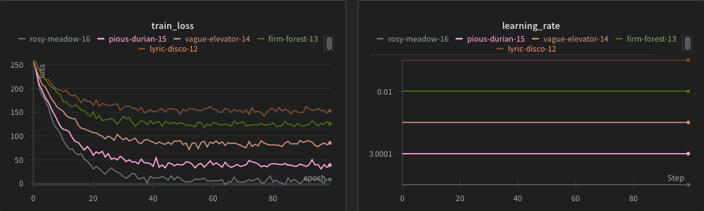
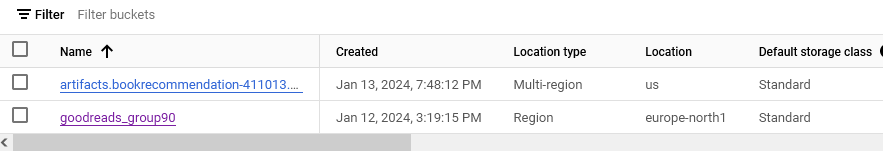
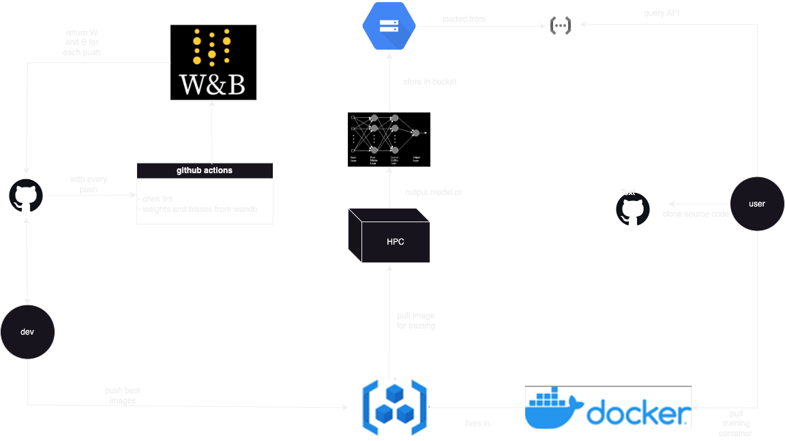

# Exam template for 02476 Machine Learning Operations

This is the report template for the exam. Please only remove the text formatted as with three dashes in front and behind
like:

```--- question 1 fill here ---```

where you instead should add your answers. Any other changes may have unwanted consequences when your report is auto
generated in the end of the course. For questions where you are asked to include images, start by adding the image to
the `figures` subfolder (please only use `.png`, `.jpg` or `.jpeg`) and then add the following code in your answer:

```markdown

```

In addition to this markdown file, we also provide the `report.py` script that provides two utility functions:

Running:

```bash
python report.py html
```

will generate an `.html` page of your report. After deadline for answering this template, we will autoscrape
everything in this `reports` folder and then use this utility to generate an `.html` page that will be your serve
as your final handin.

Running

```bash
python report.py check
```

will check your answers in this template against the constrains listed for each question e.g. is your answer too
short, too long, have you included an image when asked to.

For both functions to work it is important that you do not rename anything. The script have two dependencies that can
be installed with `pip install click markdown`.

## Overall project checklist

The checklist is *exhaustic* which means that it includes everything that you could possible do on the project in
relation the curricilum in this course. Therefore, we do not expect at all that you have checked of all boxes at the
end of the project.

### Week 1

* [ ] Create a git repository
* [ ] Make sure that all team members have write access to the github repository
* [ ] Create a dedicated environment for you project to keep track of your packages
* [ ] Create the initial file structure using cookiecutter
* [ ] Fill out the `make_dataset.py` file such that it downloads whatever data you need and
* [ ] Add a model file and a training script and get that running
* [ ] Remember to fill out the `requirements.txt` file with whatever dependencies that you are using
* [ ] Remember to comply with good coding practices (`pep8`) while doing the project
* [ ] Do a bit of code typing and remember to document essential parts of your code
* [ ] Setup version control for your data or part of your data
* [ ] Construct one or multiple docker files for your code
* [ ] Build the docker files locally and make sure they work as intended
* [ ] Write one or multiple configurations files for your experiments
* [ ] Used Hydra to load the configurations and manage your hyperparameters
* [ ] When you have something that works somewhat, remember at some point to to some profiling and see if
      you can optimize your code
* [ ] Use Weights & Biases to log training progress and other important metrics/artifacts in your code. Additionally,
      consider running a hyperparameter optimization sweep.
* [ ] Use Pytorch-lightning (if applicable) to reduce the amount of boilerplate in your code

### Week 2

* [ ] Write unit tests related to the data part of your code
* [ ] Write unit tests related to model construction and or model training
* [ ] Calculate the coverage.
* [ ] Get some continuous integration running on the github repository
* [ ] Create a data storage in GCP Bucket for you data and preferable link this with your data version control setup
* [ ] Create a trigger workflow for automatically building your docker images
* [ ] Get your model training in GCP using either the Engine or Vertex AI
* [ ] Create a FastAPI application that can do inference using your model
* [ ] If applicable, consider deploying the model locally using torchserve
* [ ] Deploy your model in GCP using either Functions or Run as the backend

### Week 3

* [ ] Check how robust your model is towards data drifting
* [ ] Setup monitoring for the system telemetry of your deployed model
* [ ] Setup monitoring for the performance of your deployed model
* [ ] If applicable, play around with distributed data loading
* [ ] If applicable, play around with distributed model training
* [ ] Play around with quantization, compilation and pruning for you trained models to increase inference speed

### Additional

* [ ] Revisit your initial project description. Did the project turn out as you wanted?
* [ ] Make sure all group members have a understanding about all parts of the project
* [ ] Uploaded all your code to github

## Group information

### Question 1
> **Enter the group number you signed up on <learn.inside.dtu.dk>**
>
 
Answer: 90


### Question 2
> **Enter the study number for each member in the group**
>
> Example:
>
> *sXXXXXX, sXXXXXX, sXXXXXX*
>
> Answer:

s230356, s240558, s240541

### Question 3
> **What framework did you choose to work with and did it help you complete the project?**
>
> Answer length: 100-200 words.
>
> Example:
> *We used the third-party framework ... in our project. We used functionality ... and functionality ... from the*
> *package to do ... and ... in our project*.
>
> Answer: 

In our project, we utilized PyTorch, a popular machine learning library, to develop a Multi-Layer Perceptron (MLP) collaborative filtering model. 
This model was specifically designed to provide recommendations for books. 

To describe a specific book and a user, we generated user and book embeddings using BERT-tiny, a smaller and faster version of the BERT model, pretrained for natural language processing tasks. 
These embeddings were then fed into the MLP model, which was trained to predict the rating a user would give to a book.

Furthermore, we used the Pandas library, a powerful data manipulation tool in Python, to handle the raw data. This involved formatting, merging, and processing the data in a manner that would enable the successful creation of embeddings. 
This comprehensive approach ensured that our model was both effective and efficient.

We used W&B to track our experiments, and to log the results of our experiments.


## Coding environment

> In the following section we are interested in learning more about you local development environment.

### Question 4

> **Explain how you managed dependencies in your project? Explain the process a new team member would have to go**
> **through to get an exact copy of your environment.**
>
> Answer length: 100-200 words
>
> Example:
> *We used ... for managing our dependencies. The list of dependencies was auto-generated using ... . To get a*
> *complete copy of our development environment, one would have to run the following commands*
>
> Answer: 

To manage dependencies effectively, we employed virtual environments. This approach allows us to isolate dependencies per project, ensuring no conflicts occur. 
We used pip freeze, a command that generates a list of all installed packages, to create our requirements. 
These were then stored in a requirements.txt file, serving as a reference for necessary packages. 
For a new team member to join our project, the process is simple and straightforward. 
They would first clone the repository, which is a copy of our project. 
Next, they would create a virtual environment, a self-contained location where they can install packages without affecting the global Python environment. 
Finally, they would install the dependencies from the requirements.txt file, ensuring they have all the necessary packages to contribute to the project.

### Question 5

> **We expect that you initialized your project using the cookiecutter template. Explain the overall structure of your**
> **code. Did you fill out every folder or only a subset?**
>
> Answer length: 100-200 words
>
> Example:
> *From the cookiecutter template we have filled out the ... , ... and ... folder. We have removed the ... folder*
> *because we did not use any ... in our project. We have added an ... folder that contains ... for running our*
> *experiments.*
> Answer:
 
The project structure includes a designated 'notebooks' folder. 
This folder is a repository of notebooks that were utilized during the initial stages of data exploration. 
The purpose of these notebooks was to gain a comprehensive understanding of the data and to identify the most effective approach for model creation. 

The 'models' folder is another crucial component of the project. 
This folder houses the 'train_model.py' script, which is responsible for training the model. 
In addition, the 'model.py' file, which defines the structure and parameters of the model, is also located in this folder. 

During the training process, the script reads from a variety of configuration files, specifically those with a .yaml extension. 
These configuration files are instrumental in setting the appropriate hyperparameters for the model, ensuring optimal performance.

The 'data' folder is another key component of the project structure. 
This folder is the storage location for both the raw and processed data that is used in the project. 

Within the 'package' folder, there is another 'data' folder. This particular folder contains the 
data processing pipeline and the dataset class. These elements are critical for the transformation and 
management of the data throughout the project.


### Question 6

> **Did you implement any rules for code quality and format? Additionally, explain with your own words why these**
> **concepts matters in larger projects.**
>
> Answer length: 50-100 words.
>
> Answer: 
 
In our project, we have adhered strictly to the standard Python style guide, 
which places a significant emphasis on code quality and formatting with the ultimate goal of achieving optimal legibility. 
This approach is not just about aesthetics or arbitrary rules; 
it's about fostering an environment that encourages enhanced comprehension among all contributors. 
By ensuring that our code is clean, well-structured, and consistently formatted, we make it easier for others to read, understand, 
and contribute to the project. This strategy has proven to be invaluable in streamlining the development process, 
making it significantly more efficient and less cumbersome. 


## Version control

> In the following section we are interested in how version control was used in your project during development to
> corporate and increase the quality of your code.

### Question 7

> **How many tests did you implement and what are they testing in your code?**
>
> Answer length: 50-100 words.
>
> Example:
> *In total we have implemented X tests. Primarily we are testing ... and ... as these the most critical parts of our*
> *application but also ... .*
>
> Answer:

In our tests, we focused on the most critical parts of our application, namely the data processing and model training.

For the data processing tests, we insured that the data was being processed without any data leakage, and that the data was being split correctly.

For the model part, we tested that the output of the model was of the correct shape, which was (batch_size, sequence_length, embedding_size).

Also, for the code tests, we ran tests for code format, unused imports.

### Question 8

> **What is the total code coverage (in percentage) of your code? If you code had an code coverage of 100% (or close**
> **to), would you still trust it to be error free? Explain you reasoning.**
>
> Answer length: 100-200 words.
>
> Example:
> *The total code coverage of code is X%, which includes all our source code. We are far from 100% coverage of our **
> *code and even if we were then...*
>
> Answer:

We tried to be as concise as possible with our tests, and we tried to minimize the amount of code that we wrote - so it was easier to test.
As far as we know, we have 100% coverage of our code, but we are not sure if we have tested all the edge cases - as the most crucial part is the model and data processing, we tested thoroughly these parts.

As far as we know, running our model with a user that has a lot of ratings (more than any user in the dataset), we can get an error for OutOfMemory, as the model is not able to handle too large inputs. This is of course a limitation of the hardware, and not the code itself.

### Question 9

> **Did you workflow include using branches and pull requests? If yes, explain how. If not, explain how branches and**
> **pull request can help improve version control.**
>
> Answer length: 100-200 words.
>
> Example:
> *We made use of both branches and PRs in our project. In our group, each member had an branch that they worked on in*
> *addition to the main branch. To merge code we ...*
>
> Answer: 
 
We adopted a systematic approach for feature development, where each new feature was crafted in a distinct branch, subsequently pulled into the 'develop' branch. For each release, 'develop' was pulled into 'main'. 
We fluidly switched between branches as per requirement, without any specific branches being exclusive to students. 
The use of branches and pull requests greatly simplified the process. It facilitated the segregation of features or modifications, enabling their integration into the working tree at a later stage. 
This strategy minimized potential conflicts, ensuring a smooth, efficient workflow, and maintaining the integrity of the project.

At the beginning of the project we used personal branches.


### Question 10

> **Did you use DVC for managing data in your project? If yes, then how did it improve your project to have version**
> **control of your data. If no, explain a case where it would be beneficial to have version control of your data.**
>
> Answer length: 100-200 words.
>
> Example:
> *We did make use of DVC in the following way: ... . In the end it helped us in ... for controlling ... part of our*
> *pipeline*
>
> Answer: 
 
Yes. DVC was used to ensure all members had the exact same raw data and also ensured that if we wanted to include more or less 
features for any given branch then switching to the appropriate data meant it was unncessary to generate the data again.

In our case the data processing was not exceptionally computationally expensive, and we could run `make data` each time we changed the `make_dataset` file. 

However, if our dataset had been larger than we would have seen more benefit. 

For another use case of DVC, we could have used it to store the model checkpoints, and the embeddings generated by the model. 


### Question 11

> **Discuss you continues integration setup. What kind of CI are you running (unittesting, linting, etc.)? Do you test**
> **multiple operating systems, python version etc. Do you make use of caching? Feel free to insert a link to one of**
> **your github actions workflow.**
>
> Answer length: 200-300 words.
>
> Example:
> *We have organized our CI into 3 separate files: one for doing ..., one for running ... testing and one for running*
> *... . In particular for our ..., we used ... .An example of a triggered workflow can be seen here: <weblink>*
>
> Answer:
In this setup, every 'push' to the code repository initiates two actions. 

Firstly, a linting program is triggered. Linting is a static code analysis tool that checks the source code for potential errors, bugs, stylistic errors, and suspicious constructs. 
This helps maintain the code's quality, readability, and adherence to coding standards, thus reducing the likelihood of errors or bugs slipping into the production code.

Secondly, the "Get Runs From Weights & Biases" action is initiated. 
Weights & Biases (WandB) is a tool used for tracking and visualizing machine learning experiments. 
This action queries your WandB project for runs that match the commit SHA (a unique identifier for each commit) that triggered the action. 
This allows you to link the specific changes in your code to the corresponding results in your WandB project, enabling a clear and 
efficient way to track the impact of each code change on the model's performance.
This CI setup is an effective way to maintain 
high-quality code and to keep track of how code changes affect model performance

In essence, this Continuous Integration (CI) setup is an effective and efficient way to maintain high-quality code. 
It also provides a systematic approach to keep track of how code changes affect model performance, 
thereby ensuring optimal results and high standards in the project's progression.


## Running code and tracking experiments

> In the following section we are interested in learning more about the experimental setup for running your code and
> especially the reproducibility of your experiments.

### Question 12

> **How did you configure experiments? Did you make use of config files? Explain with coding examples of how you would**
> **run a experiment.**
>
> Answer length: 50-100 words.
>
> Example:
> *We used a simple argparser, that worked in the following way: python my_script.py --lr 1e-3 --batch_size 25*
>
> Answer:

For our experiments we used OmegaConf to load the configurations and manage our hyperparameters.
These include: learning rate, batch size, epochs, loss function, and embedding size (hidden size of our BERT variant), and the bert checkpoint (model) we used from HuggingFace.
For a simple control over wandb logging we also included a flag to turn it on or off using argparser.

### Question 13

> **Reproducibility of experiments are important. Related to the last question, how did you secure that no information**
> **is lost when running experiments and that your experiments are reproducible?**
>
> Answer length: 100-200 words.
>
> Example:
> *We made use of config files. Whenever an experiment is run the following happens: ... . To reproduce an experiment*
> *one would have to do ...*
>
> Answer:
 
 
In our project, we have taken careful measures to ensure the reproducibility of our experiments. 
One such measure is the use of a seed for all operations that involve randomness. 
By setting a seed, we ensure that the random numbers generated in our experiments are predictable and consistent, 
which is crucial for reproducing results. 

Furthermore, we have made it a point to use the same data across all experiments. 
This consistency in data usage eliminates the possibility of variations in results due to different data sets. 

To reproduce an experiment, one would simply need to run the same 
configuration file with the same data. Specifically, the `config.yaml` file would need to be used. 
This file contains all the necessary parameters and settings for the experiment. 
By using the same `config.yaml` file and the same data, anyone can reproduce our experiments with high fidelity, 
ensuring the reliability and validity of our results.

### Question 14

> **Upload 1 to 3 screenshots that show the experiments that you have done in W&B (or another experiment tracking**
> **service of your choice). This may include loss graphs, logged images, hyperparameter sweeps etc. You can take**
> **inspiration from [this figure](figures/wandb.png). Explain what metrics you are tracking and why they are**
> **important.**
>
> Answer length: 200-300 words + 1 to 3 screenshots.
>
> Example:
> *As seen in the first image when have tracked ... and ... which both inform us about ... in our experiments.*
> *As seen in the second image we are also tracking ... and ...*
>
> Answer:

After we finalized our dataset, we first ran a sanity check with a small subset of the data to ensure that the model was working as intended.
As we saw, the model had improved over the small training set, but failed to generalize to the validation set.
We think this is due to the small size of the training set, and the fact that the model was overfitting to the training set.

It plausible that because our model's input is a changing sequence length for a transformer embedding, we needed to use a large capacity of training for it to converge. 
This is why we decided to increase the size of the subset used for experimentation.
After that, we ran a hyperparameter sweep to find the best hyperparameters for our model - looking at different learning rates we can use.
The sweep can be seen in the following image:



While we had the option to search for the best learning rate (lr) scheduler, we opted to use a constant learning rate. 
This decision was made based on our specific model requirements and the nature of our data. 
However, it's worth noting that exploring different 
lr schedulers could potentially lead to further improvements in future iterations of the model.
### Question 15

> **Docker is an important tool for creating containerized applications. Explain how you used docker in your**
> **experiments? Include how you would run your docker images and include a link to one of your docker files.**
>
> Answer length: 100-200 words.
>
> Example:
> *For our project we developed several images: one for training, inference and deployment. For example to run the*
> *training docker image: `docker run trainer:latest lr=1e-3 batch_size=64`. Link to docker file: <weblink>*
>
> Answer:

For experimenting with the model, we used docker through access to an HPC server with GPUs from our faculty.
This allowed us to run our experiments faster, and with more resources than we would have had access to with docker on the cloud.

### Question 16

> **When running into bugs while trying to run your experiments, how did you perform debugging? Additionally, did you**
> **try to profile your code or do you think it is already perfect?**
>
> Answer length: 100-200 words.
>
> Example:
> *Debugging method was dependent on group member. Some just used ... and others used ... . We did a single profiling*
> *run of our main code at some point that showed ...*
>
> Answer:
 
 
When encountering bugs during the execution of our experiments, we utilized a systematic debugging approach. 
This involved identifying the issue, isolating the part of the code causing the problem, and then implementing a solution.
We used various debugging tools and techniques, such as breakpoints, print statements, and logging, to assist in this process. 

To assist in this comprehensive debugging process, we utilized a variety of debugging tools and techniques. 
These included setting breakpoints, which allowed us to pause the execution of the program at specific points 
and examine the state of the system. We also used print statements to output the values of variables at different 
stages of execution. Additionally, we employed logging to record the flow of the program, which was particularly 
useful for tracking down elusive bugs that were difficult to reproduce. This systematic approach to debugging 
ensured efficient and effective resolution of issues, maintaining the integrity of our experiments.


## Working in the cloud

> In the following section we would like to know more about your experience when developing in the cloud.

### Question 17

> **List all the GCP services that you made use of in your project and shortly explain what each service does?**
>
> Answer length: 50-200 words.
>
> Example:
> *We used the following two services: Engine and Bucket. Engine is used for... and Bucket is used for...*
>
> Answer:
 
Compute Engine: Service that allows for the creation of VMs adhoc. Used for experimentation with training in the beginning.

Artifact registry: Used to store out docker images for training and inference

Vertex AI: Used with docker container to train more easily

Bucket: Data storage, used to store our raw and processed data

Cloud functions: Used to serve our model


### Question 18

> **The backbone of GCP is the Compute engine. Explained how you made use of this service and what type of VMs**
> **you used?**
>
> Answer length: 100-200 words.
>
> Example:
> *We used the compute engine to run our ... . We used instances with the following hardware: ... and we started the*
> *using a custom container: ...*
>
> Answer:
We orignally used a compute engine on GCP to train the model on an 8 core high performing cpu VM. 
We started the compute engine with a docker image uploaded to the registry. 
This docker image mounted the bucket data and created a processed dataset which it then used for training.

However, since Technion's data centers made their HPC server available to use for training we later opted to use it for both training and our experiments, as we had access to GPUs there. 
We have built a docker image for training, and deployed the containers on the HPC server. 

### Question 19

> **Insert 1-2 images of your GCP bucket, such that we can see what data you have stored in it.**
> **You can take inspiration from [this figure](figures/bucket.png).**
>
> Answer:





### Question 20

> **Upload one image of your GCP container registry, such that we can see the different images that you have stored.**
> **You can take inspiration from [this figure](figures/registry.png).**
>
> Answer:


### Question 21

> **Upload one image of your GCP cloud build history, so we can see the history of the images that have been build in**
> **your project. You can take inspiration from [this figure](figures/build.png).**
>
> Answer:

We did not use the GCP cloud build history, as we had access to the HPC server.

### Question 22

> **Did you manage to deploy your model, either in locally or cloud? If not, describe why. If yes, describe how and**
> **preferably how you invoke your deployed service?**
>
> Answer length: 100-200 words.
>
> Example:
> *For deployment we wrapped our model into application using ... . We first tried locally serving the model, which*
> *worked. Afterwards we deployed it in the cloud, using ... . To invoke the service an user would call*
> *`curl -X POST -F "file=@file.json"<weburl>`*
>
> Answer:

We deployed our model using Google Cloud Functions. 
We deployed everything (code, data, and model) to the gcp bucket, and then we used the cloud functions to serve the model.


### Question 23

> **Did you manage to implement monitoring of your deployed model? If yes, explain how it works. If not, explain how**
> **monitoring would help the longevity of your application.**
>
> Answer length: 100-200 words.
>
> Example:
> *We did not manage to implement monitoring. We would like to have monitoring implemented such that over time we could*
> *measure ... and ... that would inform us about this ... behaviour of our application.*
>
> Answer:


We did not manage to implement monitoring for our deployed model. 
However, having monitoring in place would have been beneficial for the longevity and reliability of our application. 
Monitoring would allow us to track the performance of our model over time, identify any potential issues or anomalies, 
and understand how the model is being used. It could provide insights into the accuracy of the model's predictions, 
the volume of requests it's handling, and its response times. 
This information could have then be used to make necessary adjustments or improvements, 
ensuring the model continues to perform optimally and meet users' needs.

### Question 24

> **How many credits did you end up using during the project and what service was most expensive?**
>
> Answer length: 25-100 words.
>
> Example:
> *Group member 1 used ..., Group member 2 used ..., in total ... credits was spend during development. The service*
> *costing the most was ... due to ...*
>
> Answer:

Not more than 200dkk. 
We spent most of the budget on making experiments at the begining with the compute engine and eventually decided to continue the experiments on the HPC server we had access to (as mentioned before). 
We then spent most of our budget on serving the model through cloud functions and the bucket for storage.


## Overall discussion of project

> In the following section we would like you to think about the general structure of your project.

### Question 25

> **Include a figure that describes the overall architecture of your system and what services that you make use of.**
> **You can take inspiration from [this figure](figures/overview.png). Additionally in your own words, explain the**
> **overall steps in figure.**
>
> Answer length: 200-400 words
>
> Example:
>
> *The starting point of the diagram is our local setup, where we integrated ... and ... and ... into our code.*
> *Whenever we commit code and puch to github, it auto triggers ... and ... . From there the diagram shows ...*
>
> Answer:



This diagram follows two roles a user that wishes to use the model and a developer that wishes to contribute to the 
project. 

The user has the following options:
- access model output through a restful API
	- the output from the model is served through cloud functions which loads the model from a gcp bucket and returns the output
	- the model is pulled from the registry and trained on the HPC server
- clone the source code and run training or inference locally using a virtual environment
- pull various docker images from the container registry to ensure reproducibility


The dev has the following options
- push and pull to github as he pleases
	- with every push his build is sent to wandb which will return a csv file with various model metrics
		- This process aids in tracking and improving model performance over time. 
	- linting will also be checked to ensure high quality code standard
		- promoting clean and efficient code by showing a failed test if a particular push does not pass the lint8 test
	
- push new docker images to the registry
	- these images will then serve the user role be used in future training. The existing docker image will be overwritten
	

### Question 26

> **Discuss the overall struggles of the project. Where did you spend most time and what did you do to overcome these**
> **challenges?**
>
> Answer length: 200-400 words.
>
> Example:
> *The biggest challenges in the project was using ... tool to do ... . The reason for this was ...*
>
> Answer:

We spent most of our time implementing a complex model using language models, and experimenting with them. 
Particularly we spent a lot of time figuring out how to create high quality embeddings from BERT for proper training.
We wanted to ensure the scalability and robustness of our model and sought to prevent overfitting over under performance.

Another time-consuming aspect was integrating with the cloud, and learning about using GCP services.

We faced challenges in setting up and configuring the GCP services, 
managing dependencies, and ensuring the smooth serving of our models in the cloud. 
To overcome these challenges, we extensively researched the tools and services, consulted online tutorials and documentation. 
Additionally, we spent considerable time debugging and 
optimizing our code to ensure its efficiency and effectiveness. Regular team meetings and collaborative 
problem-solving also played a crucial role in overcoming the challenges.
In addition to the aforementioned tasks, we also invested a significant amount of time in data preprocessing and cleaning.
This involved removing any irrelevant or redundant information, dealing with missing or incomplete data, 
and transforming the data into a format suitable for our model.

Lastly, we also focused on documentation and communication. We made sure to document our processes, findings, and decisions so
that every group member was aware of the total scope of the project.

### Question 27

> **State the individual contributions of each team member. This is required information from DTU, because we need to**
> **make sure all members contributed actively to the project**
>
> Answer length: 50-200 words.
>
> Example:
> *Student sXXXXXX was in charge of developing of setting up the initial cookie cutter project and developing of the*
> *docker containers for training our applications.*
> *Student sXXXXXX was in charge of training our models in the cloud and deploying them afterwards.*
> *All members contributed to code by...*
>
> Answer:


Student s230356 worked on setting up docker containers, model architecture, data formatting, GCP configuration, DVC configuration of data and Compute Engine configuration. Setup of CI using github actions.

Student s240558 worked on model architecture, training and evaluation methods, and experimentation. Also was in charge of the Dataset class, and the data processing pipeline. Deployed the model to GCP Cloud Functions.

Student s240541 had a role in fine-tuning the architecture, and was in charge of creating and deploying the cloud functions to serve the model in the cloud.

